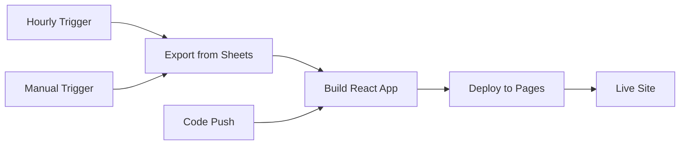

# GitHub Actions Workflows

Automated website updates and GitHub Pages deployment.

## Workflows

### 🔄 Update Website Data (`update-website.yml`)

**Schedule:** Every hour, on the hour

**What it does:**
1. Exports latest jobs from Google Sheets to JSON
2. Builds React app with Vite
3. Deploys to GitHub Pages
4. Uploads jobs data as artifact for debugging

**Triggers:**
- ⏰ **Scheduled:** Every hour (`0 * * * *`)
- 🔧 **Manual:** Via workflow_dispatch
- 📝 **Code changes:** Push to `main` (src, scripts, config files)

**Required secrets:**
- `GOOGLE_SERVICE_ACCOUNT_JSON` - Service account credentials

**Permissions:**
- `contents: read` - Checkout code
- `pages: write` - Deploy to GitHub Pages
- `id-token: write` - Verify deployment

**Usage:**
```bash
# Trigger manually via GitHub CLI
gh workflow run update-website.yml

# Or via web UI
# Actions → Update Website Data → Run workflow
```

## Setup

See `../DEPLOYMENT.md` for complete setup instructions.

### Quick Setup Checklist

- [ ] Enable GitHub Pages (Settings → Pages → Source: GitHub Actions)
- [ ] Add `GOOGLE_SERVICE_ACCOUNT_JSON` secret to GitHub
- [ ] Push code to `main` branch
- [ ] Trigger first deployment manually
- [ ] Verify site at `https://moblyze.github.io/moblyze-jobs-web/`

## Monitoring

### View Deployments
```
https://github.com/moblyze/moblyze-jobs-web/deployments
```

### View Workflow Runs
```
https://github.com/moblyze/moblyze-jobs-web/actions
```

### Check Live Site
```
https://moblyze.github.io/moblyze-jobs-web/
```

### Download Data Artifact
Every workflow run uploads the exported `jobs.json` for debugging:
1. Go to workflow run
2. Scroll to bottom → Artifacts section
3. Download `jobs-data-[run-id]`

## Deployment Pipeline



## Troubleshooting

**Site shows no jobs**
- Check that scraper has run successfully
- Verify Google Sheet has data
- Download jobs-data artifact to inspect JSON
- Verify service account has Sheet access

**GitHub Pages 404**
- Wait 5-10 minutes after first deployment
- Verify Pages source is "GitHub Actions" in settings
- Check deployment status at /deployments

**Export script fails**
- Verify `GOOGLE_SERVICE_ACCOUNT_JSON` secret is set
- Check Sheet name is "Job Scraping Results"
- Ensure service account has access to Sheet

## Performance

**Typical workflow duration:** ~80 seconds
- Checkout: 5s
- Install deps: 20s (cached)
- Export jobs: 10s
- Build: 15s
- Deploy: 30s

**Build optimization:**
- Dependencies cached via `setup-node@v4`
- Vite build is pre-optimized for production
- Concurrent deployments prevented

## Cost

- **GitHub Actions:** Free for public repositories (unlimited)
- **Expected usage:** ~2,160 minutes/month (hourly updates)
- **GitHub Pages:** Free for public repositories

**Recommendation:** Keep repository public to avoid Actions costs.

## Security

**What's safe to expose:**
- ✅ React source code (public repo)
- ✅ Built JavaScript bundles
- ✅ Jobs data (exported from public data source)

**What's protected:**
- 🔒 Service account credentials (GitHub Secret)
- 🔒 Credentials file deleted after each run
- 🔒 Never exposed in logs or artifacts

## Custom Domain (Optional)

To use `jobs.moblyze.com`:

1. Add DNS CNAME: `jobs.moblyze.com → moblyze.github.io`
2. Settings → Pages → Custom domain: `jobs.moblyze.com`
3. Update `vite.config.js` base path to `/`

## Next Steps

After first successful deployment:
- ✅ Bookmark live site URL
- ✅ Monitor first few hourly updates
- ✅ Test manual trigger for emergency updates
- 🎯 Set up custom domain (optional)
- 🎯 Add Google Analytics (optional)
- 🎯 Configure failure alerts (optional)
